:::{.green-box}
- We use the [mlr3](https://mlr3book.mlr-org.com/) ML framework for model building, training, testing, etc.
- See full script for more details => [spam.R](https://github.com/bblodfon/ml-course-2022/blob/main/spam.R)
:::

# Libraries {-}


```{.r .fold-show}
library(mlr3verse)
library(tidyverse)
library(precrec)
library(scales)
library(rpart) # trees
library(glmnet) # lasso
library(ranger) # random forest/bagged trees
library(xgboost) # boosted trees
library(e1071) # SVMs
library(nnet) # single-hidden layer neural networks
```


# Models {-}

We load the trained models (as these take time to train in a notebook) we are going to use later on:

```r
models = readRDS(file = 'spam/models.rds')
```

# Data {-}

## Info {-}

```r
task = tsk('spam')
task
```

```
<TaskClassif:spam> (4601 x 58): HP Spam Detection
* Target: type
* Properties: twoclass
* Features (57):
  - dbl (57): address, addresses, all, business, capitalAve,
    capitalLong, capitalTotal, charDollar, charExclamation, charHash,
    charRoundbracket, charSemicolon, charSquarebracket, conference,
    credit, cs, data, direct, edu, email, font, free, george, hp, hpl,
    internet, lab, labs, mail, make, meeting, money, num000, num1999,
    num3d, num415, num650, num85, num857, order, original, our, over,
    parts, people, pm, project, re, receive, remove, report, table,
    technology, telnet, will, you, your
```

```r
# task$help()
which(task$missings() > 0) # no missing values, phew!
```

```
named integer(0)
```

## Table visualization {-}

```r
DT::datatable(
  # pick some rows to show
  data = task$data(rows = sample(x = task$nrow, size = 42)),
  caption = 'Sample of spam dataset from UCI ML repo (4601 x 58)',
  options = list(searching = FALSE, scrollY = 300, scrollCollapse = TRUE)
) %>%
  DT::formatStyle(columns = 'type', backgroundColor =
    DT::styleEqual(c('spam', 'nonspam'), c('#f18384', '#9cd49a')))
```

```{=html}
<div id="htmlwidget-d4f531cbf4cbdb48b90d" style="width:100%;height:auto;" class="datatables html-widget"></div>
<script type="application/json" data-for="htmlwidget-d4f531cbf4cbdb48b90d">{"x":{"filter":"none","vertical":false,"caption":"<caption>Sample of spam dataset from UCI ML repo (4601 x 58)<\/caption>","data":[["1","2","3","4","5","6","7","8","9","10","11","12","13","14","15","16","17","18","19","20","21","22","23","24","25","26","27","28","29","30","31","32","33","34","35","36","37","38","39","40","41","42"],["nonspam","spam","spam","spam","spam","nonspam","nonspam","nonspam","nonspam","nonspam","spam","spam","nonspam","spam","nonspam","nonspam","spam","spam","nonspam","spam","nonspam","nonspam","spam","nonspam","nonspam","nonspam","nonspam","spam","spam","spam","nonspam","nonspam","nonspam","spam","nonspam","spam","nonspam","nonspam","nonspam","nonspam","nonspam","nonspam"],[0,0,0.47,0.55,0,0,0.12,0,0,0,0,0.85,0,0,0,0,0.26,0.64,0,0,0,0,0,0,0.33,0,0,0,0,0,0,0,0,1.03,0,0,0,0,0,0,14.28,0],[0,0,0,0,0,0,0.12,0,0,1.49,0,0,0,0,0,0,0,0,0,0,0,0,0,0,0,0,0,0,0,0,0,0,0,0,0,0,0,0,0,0,0,0],[1.09,0,0,0.55,1.4,0,0.12,0,1.66,0,1.64,0.42,0.8,0,0,1.58,0.52,0.64,0.03,0.27,0,0.51,0.23,0.28,0,0,0,1.9,1.63,0,0,0,0.37,0,0,0,0.05,1.57,2.04,0.59,0,0],[0,1.16,0,2.79,0,0,0,0,0,0,0,0,0,0,0,0,0,0.64,0,0,0,0,0.71,0,0,0,0,0,0,0,0,0,0,0,0,0,0,0,0,0,0,0],[2.562,2.652,7.18,4.761,1,2.047,5.264,2.818,1.518,3.5,337.25,8.777,2.44,1.428,3.157,1.538,2.689,1.136,2.589,3.816,1.857,1.885,3.184,1.958,1.857,1,1,589,2.315,3.15,1,1.625,1.264,1.447,1.578,1.583,2.972,1.276,1,1.8,1.8,3.846],[35,28,182,140,1,6,53,8,8,17,1146,54,10,5,11,4,49,4,38,69,11,12,38,55,15,1,1,1177,12,12,1,6,4,4,5,11,46,16,1,10,5,39],[123,61,359,200,13,43,1232,31,41,49,1349,553,61,40,60,20,476,25,2349,542,26,66,242,190,117,18,4,1178,44,63,5,13,43,55,60,38,963,97,8,81,9,100],[0.126,0,0,0.345,0,0,0,0,0,0,0.101,0.221,0,0,0,0,0.021,0,0.005,0.031,0,0,0,0,0,0,0,0.059,0,0.248,0,0,0,0.429,0,0,0.016,0,0,0,0,0],[0.063,0,0,1.208,1.647,0.506,0,0,0.151,0,0.858,0.177,0,1.094,0,0,0.779,0.233,0,0.252,0,0.08,0.238,0,0,0.216,0,1.008,2.695,0,0,0.74,0,0.6,0,0,0,0.045,0,0.088,0,0],[0,0.19,0,0,0,0,0.074,0,0,0,0,0.177,0,0,0,0,0.021,0,0,0.031,0,0,0,0,0,0,0,0,0,1.985,0,0,0,0,0,0,0,0,0,0,0,0],[0.126,0.381,0.056,0.259,0,1.518,0.149,0,0,0.209,0,0.221,0.371,0,0.664,0,0.129,0,0.127,0.047,0.373,0.161,0,0.074,0.132,0,0,0,0,0,0,0,0,0.257,0,0.095,0.233,0.091,0,0.177,0,0],[0.063,0,0,0,0,0.253,0,0,0,0,0,0,0,0,0,0,0,0,0.2,0.015,0,0,0,0.223,0,0,0,0,0,0.496,0,0,0,0,0,0,0.185,0,0.226,0,0,0],[0,0,0,0,0,0,0,0,0,0.209,0,0,0.123,0,0,0,0,0,0.064,0.031,0,0.08,0,0,0,0,0,0,0,0,0,0,0,0,0,0,0,0,0,0,0,0],[0,0,0,0,0,0,0,0,0,0,0,0,0,0,0,0,0,0,0,0,0,0,0,0,0.33,0,0,0,0,0,0,0,0,0,0,0,0,0,0,0,0,0],[0,0,0,0,0,0,0,0,0,0,0.98,0,0,0,0,0,0,0,0,0,0,0,0,0,0,0,0,0.76,0,0,0,0,0,0,0,0,0,0,0,0,0,0],[0,0,0,0,0,0,0,0,0,0,0,0,0,0,0,0,0,0,0,0,0,0.51,0,0,0,0,0,0,0,0,0,0,0,0,0,0,0,0,0,0,0,0],[0,0,0,0,0,0,0,0,0,0,0,0,1.6,0,0,0,0,0,0.47,0,0,0,0,0,0,0,0,0,0,0,0,0,0,0,0,0,0.45,0,0,0,0,0],[0,0,0,0,0,0,0,0,0,0,0,0,0,0,2.27,0,0,0,0,0,0,0,0,0,0,0,0,0,0,0,0,0,0,0,0,0,0,0,0,0,0,0],[0,1.16,0,0,0,0,0.12,0,0,0,0,0,0,0,0,0,0,0,0,0,0,0.51,0,0,0,0,0,0,0,0,0,0,0,0,0,0,0,0,4.08,0,0,0],[0,0,0.95,0,0,0,0,0,0.83,0,0,0,0,0,0,0,0.26,0.64,0.01,0,1.96,0,0,0,0.33,0,0,0,0,0,0,0,0,0.51,0,1.21,0.05,0,0,1.19,0,0],[0,0,0,0,0,0,0,0,0,0,0,0,0,0,0,0,0,0,0,0,0,0,0,0,0,0,0,0,0,0,0,0,0,0,0,0,0,0,0,0,0,0],[0,0,0.47,0.55,1.4,0,0,0,0,0,0,0,0,0,0,0,1.57,0.64,0.13,0,0,0,0,0,0,0,0,0,4.91,0,0,0,0,0.51,0,0,0,0,0,0,0,0],[0,0,0,0,0,1.61,0.38,0,0,0,0,0,0,0,2.27,0,0,0,0.01,0,0,0,0,0,0,0,0,0,0,0,20,0,0,0,0,0,0.05,0,0,0,0,0],[0,0,0,0,0,0,0.9,3.44,0,1.49,0.32,0,2.4,0,9.09,1.58,0,0,0.53,0,0,0,0,1.7,0.33,0,0,0.38,0,0,0,0,0,0,0,0,0.62,0,0,1.78,0,0],[0,0,0,0,0,0,0.38,3.44,0,1.49,0,0,1.6,0,2.27,3.17,0,0,0.55,0,0,0,0,0,0.33,0,0,0,0,0,0,0,0,0,0,0,0.67,0,0,1.19,0,0],[0,0,0,0,0,0,0.12,0,0,0,0,0,0,0,0,0,0.13,0,0,0.18,0,0,0,0,0,0,0,0,0,0,0,0,0,0.51,0,0,0,0,0,0,0,0],[0,0,0,0,0,0,0,0,0,0,0,0,0,0,2.27,0,0,0,0,0,0,0,0,0,0,0,0,0,0,0,0,0,0,0,0,0,0,0,0,0,0,0],[0,0,0,0,0,0,0,0,0,0,0,0,0,0,2.27,0,0,0,0,0,0,0,0,0,0,0,0,0,0,0,0,0,0,0,0,0,0,0,0,0.59,0,0],[0,0,0,0,0,0,0,0,0,2.98,1.31,0.85,0,0,0,0,0.26,1.29,0.01,0,1.96,0,0.23,0,0,0,0,0.38,0,0,0,0,0.75,0.51,0,0,0,0,0,0,0,0],[0.36,0,0,0,0,0,0,0,0,0,0.32,0,0,0,0,0,0.26,0,0.01,0.09,0,0.51,0.95,0,0,0,0,0.38,0,0,0,0,0,0,0,0,0.05,0,0,0,0,0.75],[0,0,0,0,0,3.22,0.9,0,0,0,0,0,0,0,0,0,0,0,0,0,0,0,0,0,0,0,0,0,0,0,0,0,0,0,0,0,0,0,0,0,0,0],[0.72,0,0,0,0,0,0,0,0,0,0,0.42,0,4.16,0,0,0.39,0,0,0.09,0,0,0.71,0,0,0,0,0,0,0,0,0,0,0,0,0,0,0,0,0,0,0],[0,0,0,0,0,0,0,0,0,0,0,0,0,0,0,0,0.13,0,0,0.36,0,0,0,0,0,0,0,0,0,0,0,0,0,0,0,0,0,0,0,0,0,0],[0,0,0,0,0,0,0,6.89,0,1.49,0,0,0,0,0,0,0.13,0,0.45,0,0,0.51,0,0.28,0,0,0,0,0,0,0,0,0,0,0,0,0.67,0,0,0,0,0],[0,0,0,0,0,0,0,0,0,0,0,0,0,0,0,0,0,0,0,0,0,0,0,0,0,0,0,0,0,0,0,0,0,0,0,0,0,0,0,0,0,0],[0,0,0,0,0,0,0,0,0,0,0,0,0,0,2.27,0,0,0,0,0,0,0,0,0,0,0,0,0,0,0,0,0,0,0,0,0,0,0,0,0,0,0],[0,2.32,0,0,0,0,0,0,0,0,0,0,0.8,0,2.27,0,0,0,0,0,1.96,0,0,0.56,0.67,0,0,0,0,0,0,0,0,0,0,0,0,0,0,0.59,0,1.5],[0,0,0,0,0,0,4.11,0,0,0,0,0,0.8,0,2.27,0,0,0,0.01,0,0,0,0,0.56,0.33,0,0,0,0,0,0,0,0,0.51,0,0,0,0,0,0.59,0,1.5],[0,0,0,0,0,0,0,0,0,0,0,0,0,0,2.27,0,0,0,0,0,0,0,0,0,0,0,0,0,0,0,0,0,0,0,0,0,0,0,0,0,0,0],[0,0,0,0,0,0,0,0,0,0,0.65,1.27,0,0,0,0,0,2.59,0.23,0.09,0,0,0,0,0,0,0,0.38,0,0,0,0,0,0,0,0,0.5,0,0,0,0,0.75],[0,0,0,0,0,0,0,0,0,1.49,0,0,0,0,0,0,0,0,0.01,0,0,1.02,0,0,0,0,0,0,0,0,0,0,0,0,0,0,0,0,0,0,0,0],[0,0,0.47,2.23,0,0,0,0,0,0,0.98,0.42,0,0,0,0,0.39,0.64,0.33,0.36,0,0,0.23,0.28,0.33,0,0,1.14,0,0,0,0,1.13,1.03,0,0,0.05,0.22,0,0.59,0,0],[0,0,0,0,0,0,0,0,0,0,0,0,0,0,0,0,0,0,0.03,0.09,0,0.51,0.23,0,0,0,0,0,0,0,0,0,0,0,0,0.6,0.05,0.22,0,0,0,0],[0,0,0,0,0,0,0,0,0,0,0,0.42,0,0,0,0,0,0,0.01,0,0,0,0,0,0,0,0,0,0,0,0,0,0,0,0,0,0,0,0,0,0,0],[1.81,0,0,0.55,0,0,0,0,0,0,0,0.42,0,0,0,0,0.26,0,0,0,0,0,0,0,0,0,0,0,0,0,0,0,0,0,0,0,0,0.22,0,0,0,0],[0,0,0,0,0,0,0,0,0,0,0,0,0,0,0,0,0,0,0,0,0,0.51,0,0.28,0,0,0,0,0,0,0,0,0,0,0,0,0,0.22,0,1.19,0,0],[0,1.16,0,0,0,0,0,0,0,0,0,0,0,0,0,0,0,0,0,0,0,0,0,0.28,0.33,0,0,0,0,0,0,0,0.37,0,0,0,0,0,0,0,0,0],[0,0,0,0,0,0,0,3.44,0,0,0,0,0.8,0,0,0,0,0,0,0.27,0,0,0,0,0,0,0,0,0,0,0,0,0,0,0,0,0,0.89,2.04,0,0,0],[0,0,0.47,0,0,0,0,0,0,0,0,0,0,0,0,0,0,1.29,0,0,0,0,0,0,0,0,0,0,0,0,0,0,0,0,0,0.6,0,0,0,0,0,0],[0,0,0,0.55,0,0,0,0,0,0,0.32,0.42,0,0,0,0,0.39,0.64,0,0,0,0,0.23,0,0,0,0,0,0,1.47,0,0,0,1.03,0,0.6,0,0,0,0,0,0],[0,2.32,0,0,0,1.61,0,0,0,0,0,0,0,0,0,0,0,0,0,0.36,0,0,0,0,0,0,0,0,0,0,0,0,0,0,0,0,0.05,0,0,0,0,0],[0,0,0,0,0,0,0.12,0,0,0,0,0,0,0,0,0,0,0,0.05,0,0,0,0,0,0,0,0,0,0,0,0,0,0,0,0,0,0,0,0,0,0,0],[0,0,0,0,0,0,0,0,0,0,0,0,0,0,2.27,0,0,0,0.01,0,0,0,0,2.55,0,0,0,0,0,0,0,0,0,0,0.81,0,0,0,0,0.59,0,0],[0,0,0,0,0,0,0,0,0,0,0,0,0,0,2.27,0,0,0,0,0,0,0,0,0,0,0,0,0,0,0,0,0,0,0,0,0,0,0,0,0.59,0,0],[0.72,0,0,0.55,0,0,0.12,0,1.66,0,0,0.42,0,0,0,1.58,0.78,1.94,0.09,0.72,0,0.51,0.23,0.85,0.33,0,0,0,0,0,0,0,1.13,1.03,1.62,0,0.16,0,0,2.38,0,3],[0.72,1.16,1.9,3.91,0,0,0.12,0,2.5,0,0.32,2.55,1.6,0,0,1.58,2.61,3.24,0.07,2,1.96,0.51,3.8,0.28,0,0,0,0.38,3.27,0,0,4.16,2.65,2.07,0,1.82,0.22,2.02,4.08,0.59,0,0],[1.09,0,1.42,1.67,0,1.61,0,0,0,0,0.65,2.12,0,0,0,1.58,1.57,2.59,0.05,3.27,0,1.02,1.9,0,0,0,0,0,1.63,1.47,0,0,0,1.55,0,0,0.16,0.22,2.04,0,0,0]],"container":"<table class=\"display\">\n  <thead>\n    <tr>\n      <th> <\/th>\n      <th>type<\/th>\n      <th>address<\/th>\n      <th>addresses<\/th>\n      <th>all<\/th>\n      <th>business<\/th>\n      <th>capitalAve<\/th>\n      <th>capitalLong<\/th>\n      <th>capitalTotal<\/th>\n      <th>charDollar<\/th>\n      <th>charExclamation<\/th>\n      <th>charHash<\/th>\n      <th>charRoundbracket<\/th>\n      <th>charSemicolon<\/th>\n      <th>charSquarebracket<\/th>\n      <th>conference<\/th>\n      <th>credit<\/th>\n      <th>cs<\/th>\n      <th>data<\/th>\n      <th>direct<\/th>\n      <th>edu<\/th>\n      <th>email<\/th>\n      <th>font<\/th>\n      <th>free<\/th>\n      <th>george<\/th>\n      <th>hp<\/th>\n      <th>hpl<\/th>\n      <th>internet<\/th>\n      <th>lab<\/th>\n      <th>labs<\/th>\n      <th>mail<\/th>\n      <th>make<\/th>\n      <th>meeting<\/th>\n      <th>money<\/th>\n      <th>num000<\/th>\n      <th>num1999<\/th>\n      <th>num3d<\/th>\n      <th>num415<\/th>\n      <th>num650<\/th>\n      <th>num85<\/th>\n      <th>num857<\/th>\n      <th>order<\/th>\n      <th>original<\/th>\n      <th>our<\/th>\n      <th>over<\/th>\n      <th>parts<\/th>\n      <th>people<\/th>\n      <th>pm<\/th>\n      <th>project<\/th>\n      <th>re<\/th>\n      <th>receive<\/th>\n      <th>remove<\/th>\n      <th>report<\/th>\n      <th>table<\/th>\n      <th>technology<\/th>\n      <th>telnet<\/th>\n      <th>will<\/th>\n      <th>you<\/th>\n      <th>your<\/th>\n    <\/tr>\n  <\/thead>\n<\/table>","options":{"searching":false,"scrollY":300,"scrollCollapse":true,"columnDefs":[{"className":"dt-right","targets":[2,3,4,5,6,7,8,9,10,11,12,13,14,15,16,17,18,19,20,21,22,23,24,25,26,27,28,29,30,31,32,33,34,35,36,37,38,39,40,41,42,43,44,45,46,47,48,49,50,51,52,53,54,55,56,57,58]},{"orderable":false,"targets":0}],"order":[],"autoWidth":false,"orderClasses":false,"rowCallback":"function(row, data, displayNum, displayIndex, dataIndex) {\nvar value=data[1]; $(this.api().cell(row, 1).node()).css({'background-color':value == \"spam\" ? \"#f18384\" : value == \"nonspam\" ? \"#9cd49a\" : null});\n}"}},"evals":["options.rowCallback"],"jsHooks":[]}</script>
```

## Target class balance {-}


```r
autoplot(task, type = 'target') + ylim(c(0,3000))
```

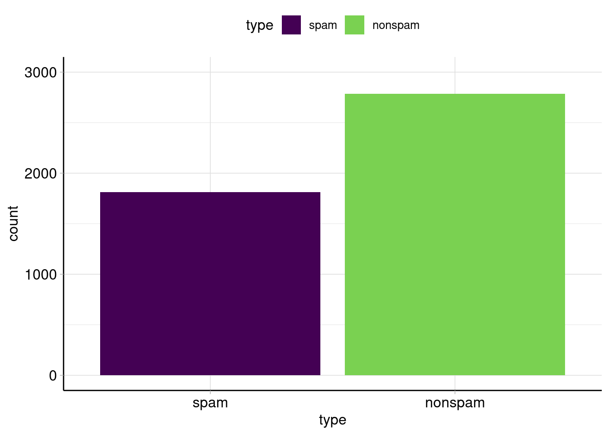


```r
task$data(cols = task$target_names) %>%
  group_by(type) %>%
  tally() %>%
  mutate(freq.percent = scales::percent(n/sum(n), accuracy = 0.1))
```

```
# A tibble: 2 × 3
  type        n freq.percent
  <fct>   <int> <chr>       
1 spam     1813 39.4%       
2 nonspam  2788 60.6%       
```

## Partition to train and test sets {-}

Stratified dataset partition (train:test ratio => 3:1, 75%:25%)


```r
split = partition(task, ratio = 0.75, stratify = TRUE)
```

How many rows (emails) for training?

```r
length(split$train)
```

```
[1] 3451
```

```r
task$data(rows = split$train, cols = task$target_names) %>%
  group_by(type) %>%
  tally() %>%
  mutate(freq.percent =  scales::percent(n/sum(n), accuracy = 0.1))
```

```
# A tibble: 2 × 3
  type        n freq.percent
  <fct>   <int> <chr>       
1 spam     1360 39.4%       
2 nonspam  2091 60.6%       
```

How many rows (emails) for testing?

```r
length(split$test)
```

```
[1] 1150
```

```r
task$data(rows = split$test, cols = task$target_names) %>%
  group_by(type) %>%
  tally() %>%
  mutate(freq.percent = scales::percent(n/sum(n), accuracy = 0.1))
```

```
# A tibble: 2 × 3
  type        n freq.percent
  <fct>   <int> <chr>       
1 spam      453 39.4%       
2 nonspam   697 60.6%       
```

Save split

```r
if ((!file.exists('spam/spam_split.rds'))) {
  saveRDS(split, file = 'spam/spam_split.rds')
  readr::write_lines(x = split$train, file = 'spam/train_index.txt')
}
split = readRDS(file = 'spam/spam_split.rds')
train_indx = split$train
test_indx  = split$test
```


# Trees {-}
## Tree complexity tuning {-}

:::{.blue-box}
`cp` hyperparameter controls the bias-variance trade-off!
:::


```r
if (!file.exists('spam/tree_res.rds')) {
  cps = c(0, 0.0001, 0.0003, 0.0005, 0.0008, 0.001, 0.003, 0.005, 0.008, 0.01,
    0.03, 0.05, 0.08, 0.1, 0.3, 0.5, 0.8, 1)

  data_list = list()
  index = 1
  for (cp in cps) {
    learner = lrn('classif.rpart', cp = cp)
    learner$train(task, row_ids = train_indx)

    train_error = learner$predict(task, row_ids = train_indx)$score()
    test_error  = learner$predict(task, row_ids = test_indx )$score()

    data_list[[index]] = list(cp = cp, train_error = train_error,
      test_error = test_error)
    index = index + 1
  }
  tree_res = dplyr::bind_rows(data_list)
  saveRDS(tree_res, file = 'spam/tree_res.rds')
}

tree_res = readRDS(file = 'spam/tree_res.rds')
```


```r
tree_res %>%
  tidyr::pivot_longer(cols = c('train_error', 'test_error'), names_to = 'type',
     values_to = 'error', names_pattern = '(.*)_') %>%
  ggplot(aes(x = cp, y = error, color = type)) +
  geom_line() +
  geom_point() +
  scale_x_continuous(
    trans = c('log10', 'reverse'),
    #breaks = scales::trans_breaks('log10', function(x) 10^x),
    labels = scales::trans_format('log10', scales::math_format(10^.x))
  ) +
  labs(y = 'Missclassification Error') +
  theme_bw(base_size = 14) +
  guides(color = guide_legend('Data set'))
```

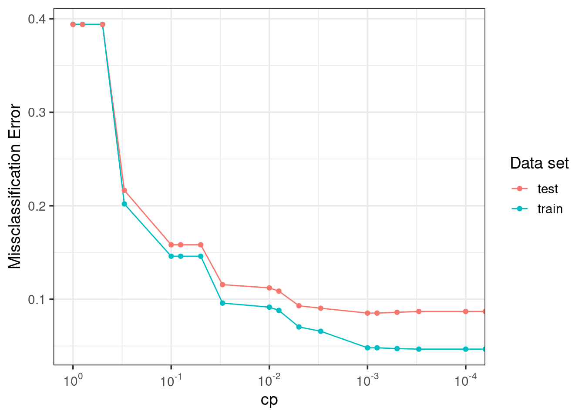

:::{.green-box}
- Train error > test error!
- `cp` choice matters! choose $cp = 0.001$
:::

## Performance {-}

Build model:

```r
tree = lrn('classif.rpart', keep_model = TRUE, cp = 0.001)
tree$predict_type = 'prob'
tree
```

```
<LearnerClassifRpart:classif.rpart>: Classification Tree
* Model: -
* Parameters: xval=0, keep_model=TRUE, cp=0.001
* Packages: mlr3, rpart
* Predict Types:  response, [prob]
* Feature Types: logical, integer, numeric, factor, ordered
* Properties: importance, missings, multiclass, selected_features,
  twoclass, weights
```

Train tree model:

```r
#tree$train(task, row_ids = train_indx)
tree = models$tree
```


```r
autoplot(tree)
```

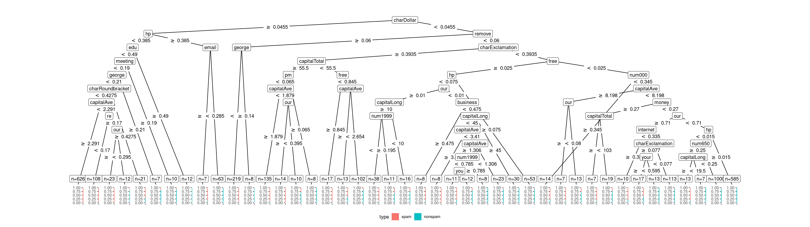

Predictions:

```r
tree_pred = tree$predict(task, row_ids = test_indx)
tree_pred
```

```
<PredictionClassif> for 1150 observations:
    row_ids   truth response  prob.spam prob.nonspam
          5    spam     spam 0.95890411   0.04109589
          7    spam     spam 0.97222222   0.02777778
         15    spam     spam 0.92105263   0.07894737
---                                                 
       4590 nonspam  nonspam 0.04800000   0.95200000
       4593 nonspam  nonspam 0.07079646   0.92920354
       4595 nonspam  nonspam 0.04800000   0.95200000
```

Confusion table:

```r
tree_pred$confusion
```

```
         truth
response  spam nonspam
  spam     401      46
  nonspam   52     651
```

Measure performance? => **(Mis)classification error** (default)

```r
tree_pred$score() 
```

```
classif.ce 
0.08521739 
```

:::{.note}
- Various classification performance metrics exist
- Prediction type matters (probability vs class)
:::


```r
mlr_measures$keys(pattern = '^classif')
```

```
 [1] "classif.acc"         "classif.auc"         "classif.bacc"       
 [4] "classif.bbrier"      "classif.ce"          "classif.costs"      
 [7] "classif.dor"         "classif.fbeta"       "classif.fdr"        
[10] "classif.fn"          "classif.fnr"         "classif.fomr"       
[13] "classif.fp"          "classif.fpr"         "classif.logloss"    
[16] "classif.mauc_au1p"   "classif.mauc_au1u"   "classif.mauc_aunp"  
[19] "classif.mauc_aunu"   "classif.mbrier"      "classif.mcc"        
[22] "classif.npv"         "classif.ppv"         "classif.prauc"      
[25] "classif.precision"   "classif.recall"      "classif.sensitivity"
[28] "classif.specificity" "classif.tn"          "classif.tnr"        
[31] "classif.tp"          "classif.tpr"        
```

ROC and ROC-AUC:

```r
tree_pred$score(msr('classif.auc')) # roc-AUC
```

```
classif.auc 
  0.9494443 
```

```r
autoplot(tree_pred, type = 'roc')
```

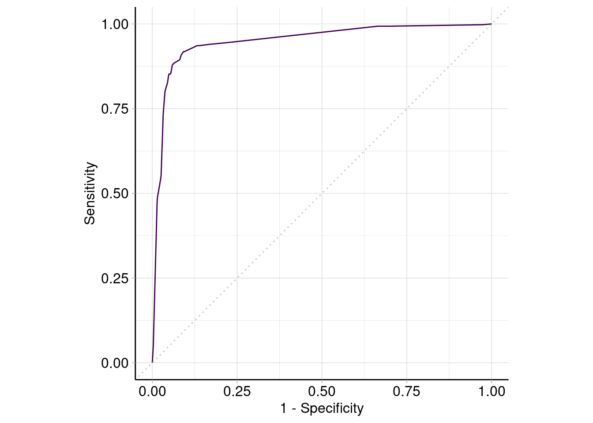

0ther measures for our tree model:

```r
tree_pred$score(msr('classif.acc'))
```

```
classif.acc 
  0.9147826 
```

```r
tree_pred$score(msr('classif.bacc'))
```

```
classif.bacc 
   0.9096063 
```

```r
tree_pred$score(msr('classif.sensitivity'))
```

```
classif.sensitivity 
          0.8852097 
```

```r
tree_pred$score(msr('classif.specificity'))
```

```
classif.specificity 
          0.9340029 
```

```r
tree_pred$score(msr('classif.precision'))
```

```
classif.precision 
        0.8970917 
```

## Feature importance {-}


```r
vimp = tibble::enframe(tree$importance(), name = 'Variable', value = 'Importance')
vimp %>%
  mutate(Variable = forcats::fct_reorder(Variable, Importance, .desc = TRUE)) %>%
  dplyr::slice(1:15) %>% # keep only the 15 most important
  ggplot(aes(x = Variable, y = Importance, fill = Variable)) +
  scale_y_continuous(expand = c(0,0)) +
  geom_bar(stat = "identity", show.legend = FALSE) +
  ggpubr::theme_classic2(base_size = 14) +
  labs(y = 'Importance', x = 'Features') +
  coord_flip()
```

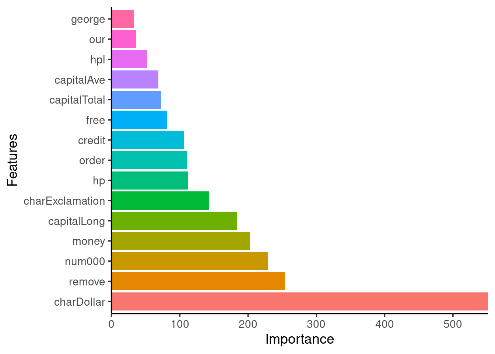

# Linear Regularized model {-}

## Lasso {-}

Model parameters:

```{.r .fold-show}
lasso = lrn('classif.cv_glmnet')
lasso$param_set$default$nfolds
```

```
[1] 10
```

```{.r .fold-show}
lasso$param_set$default$alpha # lasso
```

```
[1] 1
```

```{.r .fold-show}
lasso$param_set$default$nlambda # how many regularization parameters to try?
```

```
[1] 100
```

```{.r .fold-show}
lasso$param_set$default$s # which lambda to use for prediction?
```

```
[1] "lambda.1se"
```

```{.r .fold-show}
lasso$param_set$default$standardize # as it should!
```

```
[1] TRUE
```

Train lasso model:

```r
# lasso$train(task, row_ids = train_indx)
lasso = models$lasso
lasso$model # lots of features!
```

```

Call:  (if (cv) glmnet::cv.glmnet else glmnet::glmnet)(x = data, y = target,      family = "binomial") 

Measure: Binomial Deviance 

       Lambda Index Measure      SE Nonzero
min 0.0007552    60  0.4701 0.01648      54
1se 0.0019148    50  0.4833 0.01747      50
```

:::{.blue-box}
`lambda` hyperparameter controls the bias-variance trade-off!
:::

```r
plot(lasso$model)
```

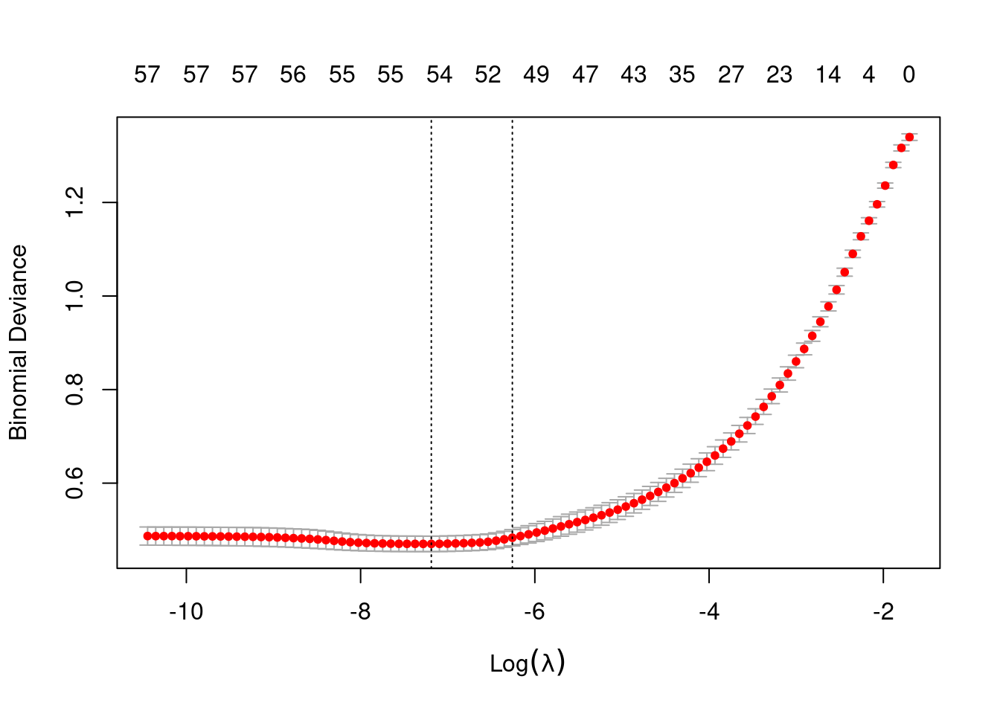


```r
log(lasso$model$lambda.min)
```

```
[1] -7.188475
```

```r
log(lasso$model$lambda.1se)
```

```
[1] -6.258138
```

Confusion matrix:

```r
lasso_pred = lasso$predict(task, row_ids = test_indx)
lasso_pred$confusion
```

```
         truth
response  spam nonspam
  spam     392      23
  nonspam   61     674
```

Misclassification error:

```r
lasso_pred$score()
```

```
classif.ce 
0.07304348 
```

## Lasso 2 {-}

:::{.blue-box}
- Let's change the measure that `cv.glmnet` uses in the cross validation of `lambda` from binomial deviance (probability-based) to the misclassification error (class response-based).
:::

Train new lasso model:

```r
#lasso2 = lasso$clone(deep = TRUE)$reset() # remove trained model
#lasso2$param_set$values = list(type.measure = 'class')
#lasso2$train(task, row_ids = train_indx)
lasso2 = models$lasso2
lasso2$model
```

```

Call:  (if (cv) glmnet::cv.glmnet else glmnet::glmnet)(x = data, y = target,      type.measure = "class", family = "binomial") 

Measure: Misclassification Error 

       Lambda Index Measure       SE Nonzero
min 0.0002473    72 0.07186 0.004849      55
1se 0.0010957    56 0.07650 0.004439      53
```

Confusion matrix:

```r
lasso2_pred = lasso2$predict(task, row_ids = test_indx)
lasso2_pred$confusion
```

```
         truth
response  spam nonspam
  spam     394      26
  nonspam   59     671
```

Misclassification error:

```r
lasso2_pred$score()
```

```
classif.ce 
0.07391304 
```

:::{.green-box}
- Better than a tuned tree model!
:::

# Bagging and Random Forests {-}


```r
nfeats = length(task$feature_names)
base_rf = lrn('classif.ranger', verbose = FALSE, num.threads = 16)
base_rf
```

```
<LearnerClassifRanger:classif.ranger>
* Model: -
* Parameters: num.threads=16, verbose=FALSE
* Packages: mlr3, mlr3learners, ranger
* Predict Types:  [response], prob
* Feature Types: logical, integer, numeric, character, factor, ordered
* Properties: hotstart_backward, importance, multiclass, oob_error,
  twoclass, weights
```

Train and test RFs with different `num.trees` and `mtry`:

```r
if (!file.exists('spam/forest_res.rds')) {
  ntrees = c(1, seq(from = 10, to = 500, by = 10))
  mtrys = c(nfeats, ceiling(nfeats/2), ceiling(sqrt(nfeats)), 1)

  data_list = list()
  index = 1
  for (num.trees in ntrees) {
    for (mtry in mtrys) {
      message('#Trees: ', num.trees, ', mtry: ', mtry)

      base_rf$reset()
      base_rf$param_set$values$num.trees = num.trees
      base_rf$param_set$values$mtry = mtry

      # train model, get train set, test set and OOB errors
      base_rf$train(task, train_indx)
      train_error = base_rf$predict(task, train_indx)$score()
      test_error  = base_rf$predict(task, test_indx )$score()
      oob_error   = base_rf$oob_error()
      train_time  = base_rf$timings['train'] # in secs

      data_list[[index]] = tibble::tibble(ntrees = num.trees, mtry = mtry,
        train_time = train_time, train_error = train_error,
        test_error = test_error, oob_error = oob_error)
      index = index + 1
    }
  }

  forest_res = dplyr::bind_rows(data_list)

  saveRDS(forest_res, file = 'spam/forest_res.rds')
}
forest_res = readRDS(file = 'spam/forest_res.rds')
```

## Tuning `num.trees` and `mtry` {-}


```r
forest_res %>%
  mutate(mtry = as.factor(mtry)) %>%
  ggplot(aes(x = ntrees, y = test_error, color = mtry)) +
  geom_point() +
  geom_line() +
  geom_vline(xintercept = 200, color = 'red', linetype = 'dashed') +
  labs(y = 'Test Error', x = 'Number of Trees',
    title = 'Bagging vs Random Forests (mtry)') +
  theme_bw(base_size = 14)
```

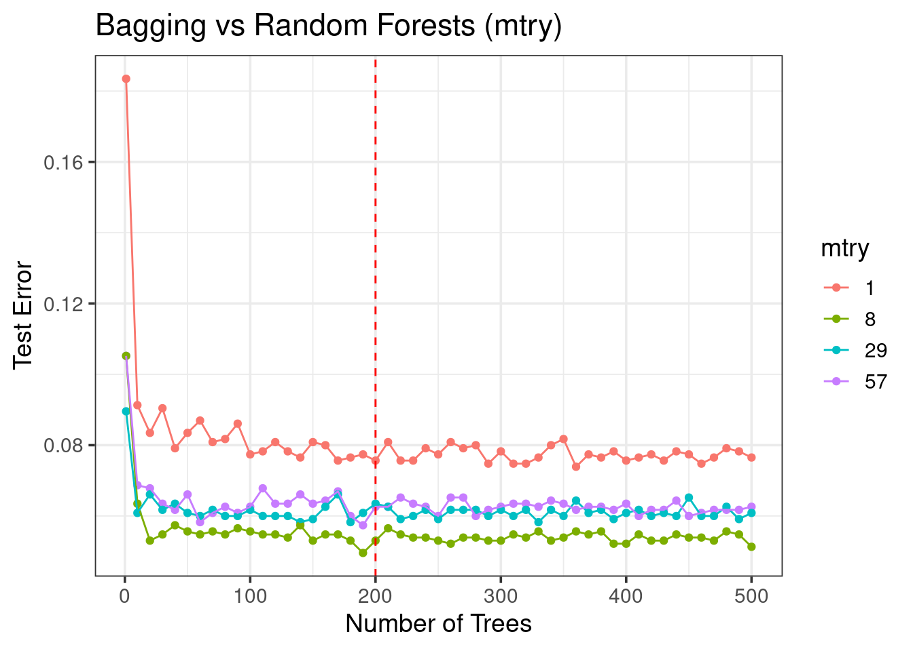

:::{.green-box}
- Not all trees are needed!
- Tuning `mtry` is important!
- RFs is a better model than bagged trees
:::

## Training time {-}


```r
forest_res %>%
  mutate(mtry = as.factor(mtry)) %>%
  ggplot(aes(x = ntrees, y = train_time, color = mtry)) +
  geom_point() +
  geom_line() +
  geom_vline(xintercept = 200, color = 'red', linetype = 'dashed') +
  labs(y = 'Time to train Forest (secs)', x = 'Number of Trees',
    title = 'Parallelized training using 16 cores') +
  theme_bw(base_size = 14)
```

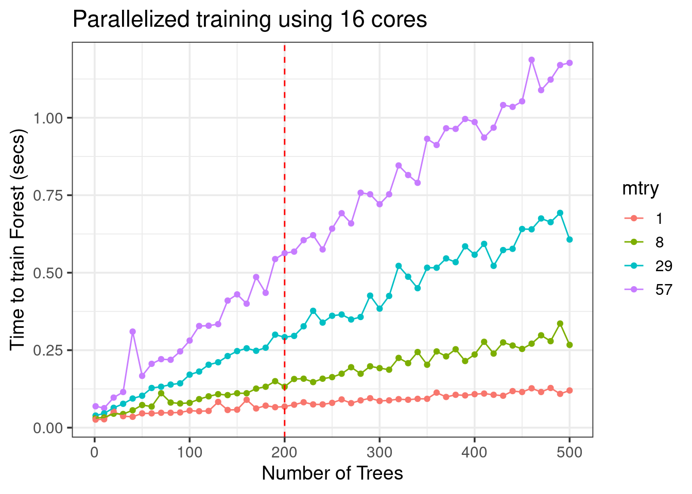

:::{.green-box}
- Parallelization is important!
:::

## OOB vs test error {-}


```r
forest_res %>%
  filter(mtry == 8) %>%
  tidyr::pivot_longer(cols = ends_with('error'), names_pattern = '(.*)_error',
    names_to = 'type', values_to = 'error') %>%
  ggplot(aes(x = ntrees, y = error, color = type)) +
  geom_line() +
  labs(x = 'Number of Trees', y = 'Misclassification Error',
    title = 'Out-Of-Bag error for generalization',
    subtitle = 'mtry = 8 features') +
  theme_bw(base_size = 14)
```

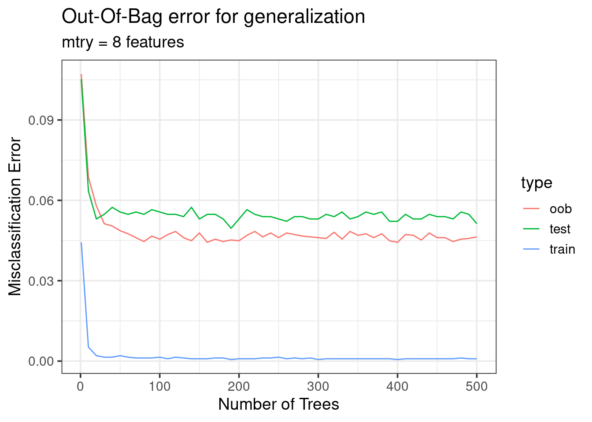

:::{.green-box}
- OOB error is a good approximation of the generalization error!
:::

## Performance {-}

Let's use $num.trees=200$ and $mtry=57$ (all features) for the bagged ensemble tree model while $mtry=8$ (square root of #features) for the random forest model:

```r
bagged_trees = base_rf$clone(deep = TRUE)$reset()
random_forest = base_rf$clone(deep = TRUE)$reset()

bagged_trees$param_set$values$num.trees = 200
bagged_trees$param_set$values$mtry = nfeats
random_forest$param_set$values$num.trees = 200
random_forest$param_set$values$mtry = 8
random_forest$param_set$values$importance = 'permutation'

bagged_trees$train(task, train_indx)
random_forest$train(task, train_indx)
```

Trained random forest model:

```r
random_forest = models$random_forest
random_forest$model
```

```
Ranger result

Call:
 ranger::ranger(dependent.variable.name = task$target_names, data = task$data(),      probability = self$predict_type == "prob", case.weights = task$weights$weight,      num.threads = 16L, verbose = FALSE, num.trees = 200L, mtry = 8L,      importance = "permutation") 

Type:                             Classification 
Number of trees:                  200 
Sample size:                      3451 
Number of independent variables:  57 
Mtry:                             8 
Target node size:                 1 
Variable importance mode:         permutation 
Splitrule:                        gini 
OOB prediction error:             4.67 % 
```

Bagged trees prediction performance:

```r
bagged_trees = models$bagged_trees
bt_pred = bagged_trees$predict(task, test_indx)
bt_pred$confusion
```

```
         truth
response  spam nonspam
  spam     405      29
  nonspam   48     668
```

```r
bt_pred$score()
```

```
classif.ce 
0.06695652 
```

Random forest prediction performance:

```r
rf_pred = random_forest$predict(task, test_indx)
rf_pred$confusion
```

```
         truth
response  spam nonspam
  spam     412      22
  nonspam   41     675
```

```r
rf_pred$score()
```

```
classif.ce 
0.05478261 
```

:::{.green-box}
- Bagged trees show better performance (lower error) on the test set compared to Lasso
- Random forests do even better than bagged trees (as expected)
:::

## Feature Importance {-}


```r
rf_vimp = tibble::enframe(random_forest$importance(), name = 'Variable',
  value = 'Importance')
rf_vimp %>%
  mutate(Variable = forcats::fct_reorder(Variable, Importance, .desc = TRUE)) %>%
  dplyr::slice(1:15) %>% # keep only the 15 most important
  ggplot(aes(x = Variable, y = Importance, fill = Variable)) +
  scale_y_continuous(expand = c(0,0)) +
  geom_bar(stat = "identity", show.legend = FALSE) +
  ggpubr::theme_classic2(base_size = 14) +
  labs(y = 'Permutation Importance', x = 'Features') +
  coord_flip()
```

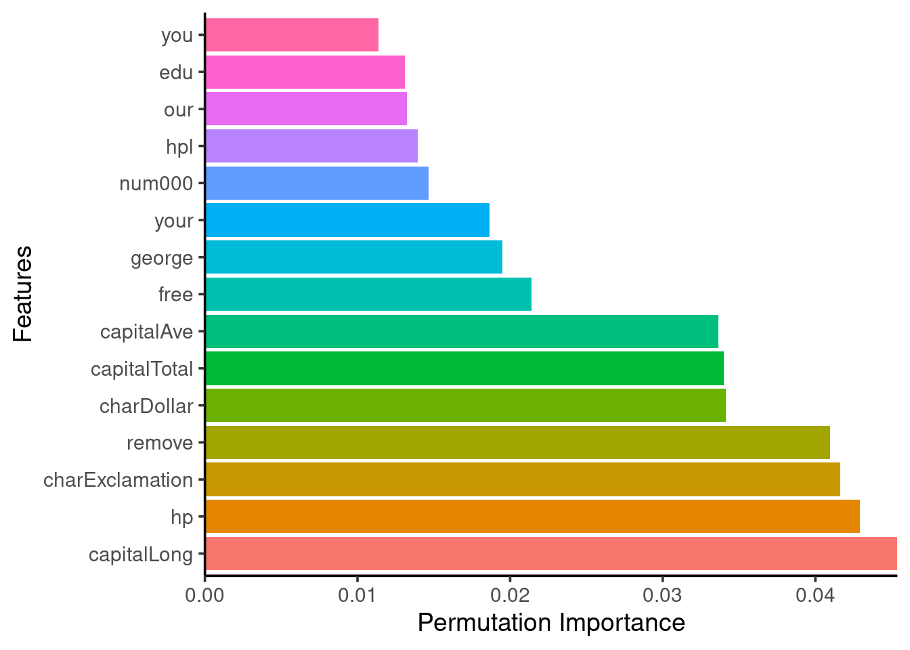

:::{.green-box}
- RF feature importance != single tree feature importance (but top features are approximately the same)
:::

# Gradient-boosted Trees {-}


```r
base_xgboost = lrn('classif.xgboost', nthread = 8,
  nrounds = 150, max_depth = 5, eta = 0.3)
base_xgboost
```

```
<LearnerClassifXgboost:classif.xgboost>
* Model: -
* Parameters: nrounds=150, nthread=8, verbose=0,
  early_stopping_set=none, max_depth=5, eta=0.3
* Packages: mlr3, mlr3learners, xgboost
* Predict Types:  [response], prob
* Feature Types: logical, integer, numeric
* Properties: hotstart_forward, importance, missings, multiclass,
  twoclass, weights
```

## Tuning XGBoost {-}

Train and test GB trees with different:

- `nrounds` (how many trees/boosting iterations)
- `max_depth` (how large can each tree grow)
- `eta` (learning rate)


```r
if (!file.exists('spam/xgboost_res.rds')) {
  max_depths = c(1,3,5,7) # how large is each tree?
  etas = c(0.001, 0.01, 0.1, 0.3) # learning rate
  nrounds = c(1, seq(from = 25, to = 1500, by = 25)) # number of trees

  param_grid = data.table::CJ(nrounds = nrounds, max_depth = max_depths,
    eta = etas, sorted = FALSE)

  data_list = list()
  index = 1
  for (row_id in 1:nrow(param_grid)) {
    max_depth = param_grid[row_id]$max_depth
    nrounds = param_grid[row_id]$nrounds
    eta = param_grid[row_id]$eta

    message('#Trees: ', nrounds, ', max_depth: ', max_depth, ', eta: ', eta)

    base_xgboost$reset()
    base_xgboost$param_set$values$nrounds = nrounds
    base_xgboost$param_set$values$max_depth = max_depth
    base_xgboost$param_set$values$eta = eta

    # train model, get train set, test set and OOB errors
    base_xgboost$train(task, train_indx)
    train_error = base_xgboost$predict(task, train_indx)$score()
    test_error  = base_xgboost$predict(task, test_indx )$score()
    train_time  = base_xgboost$timings['train'] # in secs

    data_list[[row_id]] = tibble::tibble(nrounds = nrounds,
      max_depth = max_depth, eta = eta, train_time = train_time,
      train_error = train_error, test_error = test_error)
  }

  xgboost_res = dplyr::bind_rows(data_list)

  saveRDS(xgboost_res, file = 'spam/xgboost_res.rds')
}
```

## Effect of `max_depth` vs `nrounds` {-}


```r
xgboost_res = readRDS(file = 'spam/xgboost_res.rds')
xgboost_res %>%
  filter(eta == 0.01) %>%
  mutate(max_depth = as.factor(max_depth)) %>%
  ggplot(aes(x = nrounds, y = test_error, color = max_depth)) +
  geom_point() +
  geom_line() +
  labs(y = 'Test Error', x = 'Number of Trees (Boosting Iterations)',
    title = 'Effect of max_depth on test error (eta = 0.01)') +
  theme_bw(base_size = 14)
```

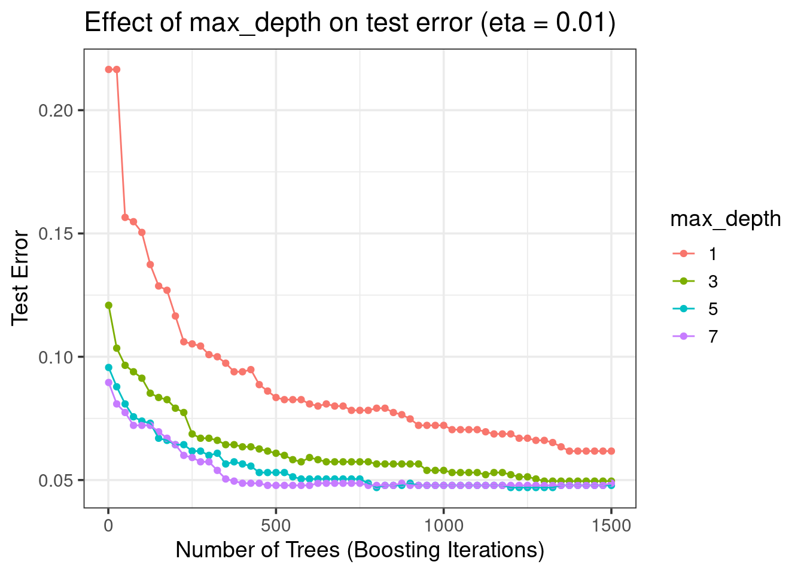

:::{.green-box}
- Best: $max\_depth = 5$
:::

## Effect of `eta` vs `nrounds` {-}


```r
xgboost_res %>%
  filter(max_depth == 5) %>%
  mutate(eta = as.factor(eta)) %>%
  ggplot(aes(x = nrounds, y = test_error, color = eta)) +
  geom_point() +
  geom_line() +
  labs(y = 'Test Error', x = 'Number of Trees (Boosting Iterations)',
    title = 'Effect of eta (learning rate) on test error (max_depth = 5)') +
  theme_bw(base_size = 14)
```

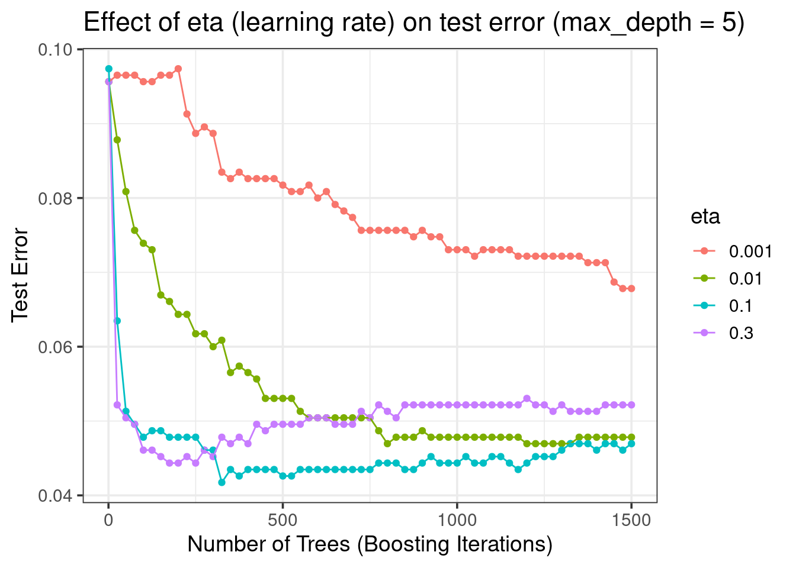

:::{.green-box}
- `eta` small => slow training
- `eta` large => overfitting occurs!
- Choose $eta=0.01$ and $nrounds=1000$ for final model
:::

## Training time {-}


```r
xgboost_res %>%
  filter(eta == 0.01) %>%
  mutate(max_depth = as.factor(max_depth)) %>%
  ggplot(aes(x = nrounds, y = train_time, color = max_depth)) +
  geom_point() +
  geom_line() +
  labs(y = 'Time to train (secs)', x = 'Number of Trees (Boosting Iterations)',
    title = 'Parallelized training using 8 cores (eta = 0.01)') +
  theme_bw(base_size = 14)
```

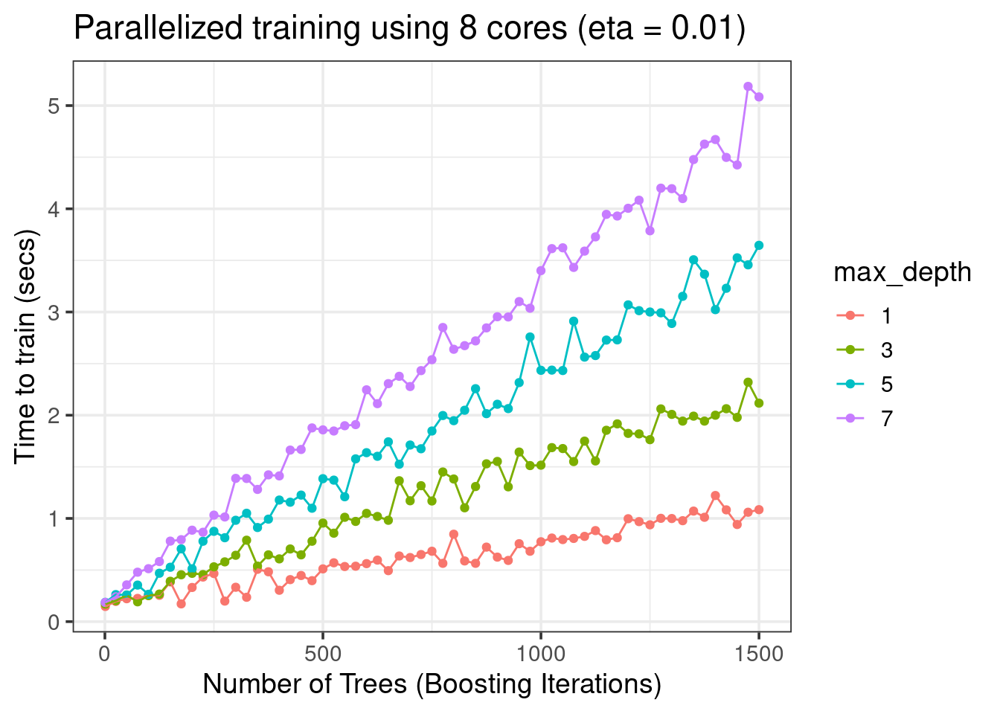

```r
xgboost_res %>%
  filter(max_depth == 5) %>%
  mutate(eta = as.factor(eta)) %>%
  ggplot(aes(x = nrounds, y = train_time, color = eta)) +
  geom_point() +
  geom_line() +
  labs(y = 'Time to train (secs)', x = 'Number of Trees (Boosting Iterations)',
    title = 'Parallelized training using 8 cores (max_depth = 5)') +
  theme_bw(base_size = 14)
```

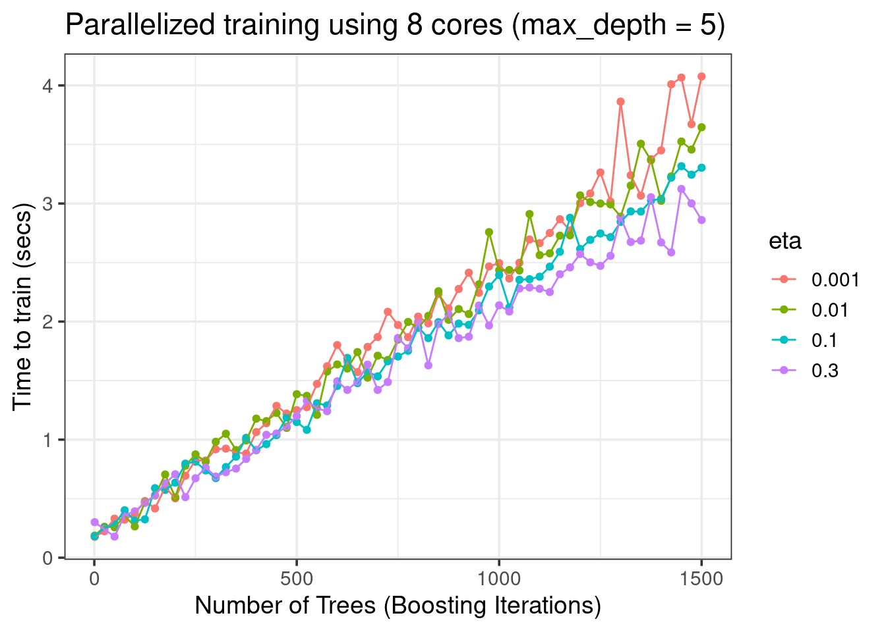

:::{.green-box}
- More trees (`nrounds`) => more training time
- Growing larger trees (`max_depth`) takes more time
- `eta` not so important for faster training in this dataset
:::

## Performance {-}

Let's use $nrounds=1000$, $max\_depth=5$ and $eta=0.01$:


```r
xgb = base_xgboost$clone(deep = TRUE)$reset()
xgb$param_set$values$nrounds = 1000
xgb$param_set$values$max_depth = 5
xgb$param_set$values$eta = 0.01

# `logloss` is the default (negative log-likelihood)
# loss function used in xgboost for classification
# but we can change that to misclassification error
# see https://xgboost.readthedocs.io/en/stable/parameter.html#learning-task-parameters

# xgb$param_set$values$eval_metric = 'error'

xgb$train(task, train_indx)
```


```r
xgb = models$xgb
xgb$model
```

```
##### xgb.Booster
Handle is invalid! Suggest using xgb.Booster.complete
raw: 1.6 Mb 
call:
  xgboost::xgb.train(data = data, nrounds = 1000L, verbose = 0L, 
    nthread = 8L, max_depth = 5L, eta = 0.01, objective = "binary:logistic", 
    eval_metric = "logloss")
params (as set within xgb.train):
  nthread = "8", max_depth = "5", eta = "0.01", objective = "binary:logistic", eval_metric = "logloss", validate_parameters = "TRUE"
# of features: 57 
niter: 1000
nfeatures : 57 
```

Confusion matrix:

```r
xgb_pred = xgb$predict(task, test_indx)
xgb_pred$confusion
```

```
         truth
response  spam nonspam
  spam     420      22
  nonspam   33     675
```

Misclassification error:

```r
xgb_pred$score()
```

```
classif.ce 
0.04782609 
```

:::{.green-box}
- GBoosted trees have even better performance than random forests
:::

## Feature importance {-}

:::{.note}
- Use `xgboost::xgb.importance()` function
:::


```r
xgb_vimp = tibble::enframe(xgb$importance(), name = 'Variable',
  value = 'Importance')
xgb_vimp %>%
  mutate(Variable = forcats::fct_reorder(Variable, Importance, .desc = TRUE)) %>%
  dplyr::slice(1:15) %>% # keep only the 15 most important
  ggplot(aes(x = Variable, y = Importance, fill = Variable)) +
  scale_y_continuous(expand = c(0,0)) +
  geom_bar(stat = "identity", show.legend = FALSE) +
  ggpubr::theme_classic2(base_size = 14) +
  labs(y = 'XGBoost Importance', x = 'Features') +
  coord_flip()
```

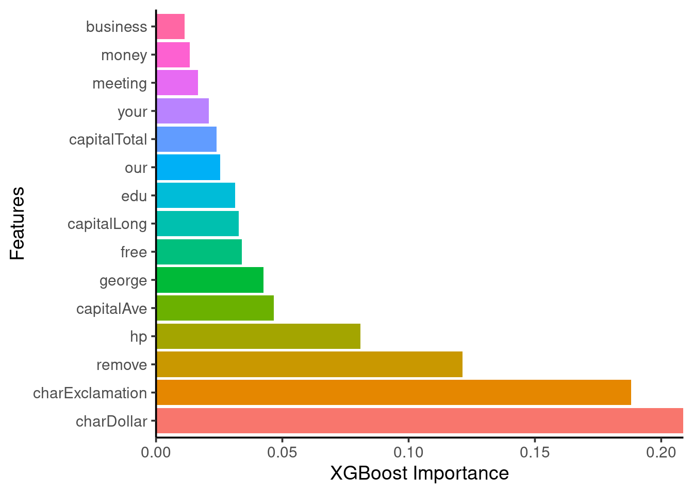

# SVMs {-}


```r
base_svm = lrn('classif.svm')
base_svm$param_set$values$type = 'C-classification'
```

Let's train a SVM model with a **polynomial kernel**:

```r
poly_svm = base_svm$clone(deep = TRUE)
poly_svm$param_set$values$kernel = 'polynomial'
poly_svm$param_set$values$degree = 3
poly_svm$param_set$values$cost = 1000 # cost => bias-variance tradeoff

poly_svm$train(task, row_ids = train_indx)
```


```r
poly_svm = models$poly_svm
poly_svm$model
```

```

Call:
svm.default(x = data, y = task$truth(), type = "C-classification", 
    kernel = "polynomial", degree = 3L, cost = 1000, probability = (self$predict_type == 
        "prob"))


Parameters:
   SVM-Type:  C-classification 
 SVM-Kernel:  polynomial 
       cost:  1000 
     degree:  3 
     coef.0:  0 

Number of Support Vectors:  776
```

Misclassification error:

```r
svm_pred = poly_svm$predict(task, row_ids = test_indx)
svm_pred$score()
```

```
classif.ce 
0.06695652 
```

Let's train a SVM model with a **radial basis kernel**:

```r
radial_svm = base_svm$clone(deep = TRUE)
radial_svm$param_set$values$kernel = 'radial'
radial_svm$param_set$values$gamma = 0.01
radial_svm$param_set$values$cost = 3

radial_svm$train(task, row_ids = train_indx)
```


```r
radial_svm = models$radial_svm
radial_svm$model
```

```

Call:
svm.default(x = data, y = task$truth(), type = "C-classification", 
    kernel = "radial", gamma = 0.01, cost = 3, probability = (self$predict_type == 
        "prob"))


Parameters:
   SVM-Type:  C-classification 
 SVM-Kernel:  radial 
       cost:  3 

Number of Support Vectors:  872
```

Misclassification error:

```r
svm_pred = radial_svm$predict(task, row_ids = test_indx)
svm_pred$score() # ~5.2%
```

```
classif.ce 
0.05217391 
```

:::{.note}
- The results above were from manual tuning => I played around with the hyperparameters `cost`, `gamma`, `degree`, until I got a better (lower) error.
- Can we do better? Well, it is difficult to properly tune these complex models! I tried a bit of Bayesian Optimization tuning (see [tuning_svms_on_spam.R](https://github.com/bblodfon/ml-course-2022/blob/main/spam/tuning_svms_on_spam.R)) and got $\approx 6\%$ error - so nothing too great.
:::

# Neural Networks {-}
## Single-layer NN {-}


```r
nnet = lrn('classif.nnet', size = 20, MaxNWts = 10000, maxit = 500)
nnet$train(task, row_ids = train_indx)
```


```r
nnet = models$nnet
nnet
```

```
<LearnerClassifNnet:classif.nnet>
* Model: nnet.formula
* Parameters: size=20, MaxNWts=10000, maxit=500
* Packages: mlr3, mlr3learners, nnet
* Predict Types:  response, [prob]
* Feature Types: numeric, factor, ordered
* Properties: multiclass, twoclass, weights
```

```r
nnet$model
```

```
a 57-20-1 network with 1181 weights
inputs: address addresses all business capitalAve capitalLong capitalTotal charDollar charExclamation charHash charRoundbracket charSemicolon charSquarebracket conference credit cs data direct edu email font free george hp hpl internet lab labs mail make meeting money num000 num1999 num3d num415 num650 num85 num857 order original our over parts people pm project re receive remove report table technology telnet will you your 
output(s): type 
options were - entropy fitting 
```


```r
nnet$predict(task, test_indx)$score() # ~5.4%
```

```
classif.ce 
0.05478261 
```

## Multi-layer NN {-}

:::{.blue-box} 
- We switch to python for this! See http://tiny.cc/spam-nn
:::

# Stacked model {-}

We are going to make a 2-level staking model using base models we have already seen.
We will use the implementation from [mlr3pipelines::mlr_graphs_stacking](https://mlr3pipelines.mlr-org.com/reference/mlr_graphs_stacking.html).

Visualize stacked learner:

```r
base_learners = list(
  lrn('classif.cv_glmnet', type.measure = 'class'), # Lasso
  lrn('classif.ranger', verbose = FALSE, num.threads = 16,
    num.trees = 200, mtry = 8), # RFs
  lrn('classif.xgboost', nthread = 8, nrounds = 1000,
    max_depth = 5, eta = 0.01), # XGBoost
  lrn('classif.svm', type = 'C-classification', kernel = 'radial',
    gamma = 0.01, cost = 3) # SVM
)
super_learner = lrn('classif.rpart', keep_model = TRUE, cp = 0.001) # tree

graph_stack = mlr3pipelines::pipeline_stacking(
  base_learners, super_learner, folds = 5, use_features = TRUE
)
graph_stack$plot(html = TRUE)
```

```{=html}
<div id="htmlwidget-5cd55321e7002f601086" style="width:50%;height:400px;" class="visNetwork html-widget"></div>
<script type="application/json" data-for="htmlwidget-5cd55321e7002f601086">{"x":{"nodes":{"id":["classif.cv_glmnet","classif.ranger","classif.xgboost","classif.svm","nop","featureunion","<INPUT>","classif.rpart","<OUTPUT>"],"label":["classif.cv_glmnet","classif.ranger","classif.xgboost","classif.svm","nop","featureunion","<INPUT>","classif.rpart","<OUTPUT>"],"shape":["box","box","box","box","box","box","database","box","ellipse"],"color":["lightblue","lightblue","lightblue","lightblue","lightblue","lightblue","rgba(0,204,102,0.2)","lightblue","rgba(255,51,51,0.2)"],"value":[1,1,1,1,1,1,0.8,1,0.8],"title":["<p>PipeOp: <b>classif.cv_glmnet<\/b> (not trained)<br>values: <b>resampling.method=cv, resampling.folds=5, resampling.keep_response=FALSE, type.measure=class<\/b><br>Input channels <b>name [train type, predict type]<\/b>:<br>  input [TaskClassif,TaskClassif]<br>Output channels <b>name [train type, predict type]<\/b>:<br>  output [TaskClassif,TaskClassif]<\/p>","<p>PipeOp: <b>classif.ranger<\/b> (not trained)<br>values: <b>resampling.method=cv, resampling.folds=5, resampling.keep_response=FALSE, mtry=8, num.threads=16, num.trees=200, verbose=FALSE<\/b><br>Input channels <b>name [train type, predict type]<\/b>:<br>  input [TaskClassif,TaskClassif]<br>Output channels <b>name [train type, predict type]<\/b>:<br>  output [TaskClassif,TaskClassif]<\/p>","<p>PipeOp: <b>classif.xgboost<\/b> (not trained)<br>values: <b>resampling.method=cv, resampling.folds=5, resampling.keep_response=FALSE, early_stopping_set=none, eta=0.01, max_depth=5, nrounds=1000, nthread=8, verbose=0<\/b><br>Input channels <b>name [train type, predict type]<\/b>:<br>  input [TaskClassif,TaskClassif]<br>Output channels <b>name [train type, predict type]<\/b>:<br>  output [TaskClassif,TaskClassif]<\/p>","<p>PipeOp: <b>classif.svm<\/b> (not trained)<br>values: <b>resampling.method=cv, resampling.folds=5, resampling.keep_response=FALSE, cost=3, gamma=0.01, kernel=radial, type=C-classification<\/b><br>Input channels <b>name [train type, predict type]<\/b>:<br>  input [TaskClassif,TaskClassif]<br>Output channels <b>name [train type, predict type]<\/b>:<br>  output [TaskClassif,TaskClassif]<\/p>","<p>PipeOp: <b>nop<\/b> (not trained)<br>values: <b>list()<\/b><br>Input channels <b>name [train type, predict type]<\/b>:<br>  input [*,*]<br>Output channels <b>name [train type, predict type]<\/b>:<br>  output [*,*]<\/p>","<p>PipeOp: <b>featureunion<\/b> (not trained)<br>values: <b>list()<\/b><br>Input channels <b>name [train type, predict type]<\/b>:<br>  ... [Task,Task]<br>Output channels <b>name [train type, predict type]<\/b>:<br>  output [Task,Task]<\/p>","<p>Input:<br>Name: classif.cv_glmnet.input<br>Train: TaskClassif<br>Predict: TaskClassif<br>Input:<br>Name: classif.ranger.input<br>Train: TaskClassif<br>Predict: TaskClassif<br>Input:<br>Name: classif.xgboost.input<br>Train: TaskClassif<br>Predict: TaskClassif<br>Input:<br>Name: classif.svm.input<br>Train: TaskClassif<br>Predict: TaskClassif<br>Input:<br>Name: nop.input<br>Train: *<br>Predict: *<\/p>","<p>PipeOp: <b>classif.rpart<\/b> (not trained)<br>values: <b>xval=0, keep_model=TRUE, cp=0.001<\/b><br>Input channels <b>name [train type, predict type]<\/b>:<br>  input [TaskClassif,TaskClassif]<br>Output channels <b>name [train type, predict type]<\/b>:<br>  output [NULL,PredictionClassif]<\/p>","<p>Output:<br>Name: classif.rpart.output<br>Train: NULL<br>Predict: PredictionClassif<\/p>"],"x":[-1,-0.5,0,0.5,1,0,0,0,0],"y":[-0.5,-0.5,-0.5,-0.5,-0.5,0,-1,0.5,1]},"edges":{"from":["classif.cv_glmnet","classif.ranger","classif.xgboost","classif.svm","nop","featureunion","<INPUT>","<INPUT>","<INPUT>","<INPUT>","<INPUT>","classif.rpart"],"to":["featureunion","featureunion","featureunion","featureunion","featureunion","classif.rpart","classif.cv_glmnet","classif.ranger","classif.xgboost","classif.svm","nop","<OUTPUT>"],"color":["lightblue","lightblue","lightblue","lightblue","lightblue","lightblue","lightblue","lightblue","lightblue","lightblue","lightblue","lightblue"]},"nodesToDataframe":true,"edgesToDataframe":true,"options":{"width":"100%","height":"100%","nodes":{"shape":"dot","physics":false},"manipulation":{"enabled":false},"edges":{"arrows":"to","smooth":{"enabled":false,"forceDirection":"vertical"}},"physics":{"stabilization":false}},"groups":null,"width":"50%","height":"400px","idselection":{"enabled":false},"byselection":{"enabled":false},"main":null,"submain":null,"footer":null,"background":"rgba(0, 0, 0, 0)","igraphlayout":{"type":"full"}},"evals":[],"jsHooks":[]}</script>
```


```r
stacked_lrn = as_learner(graph_stack)
stacked_lrn

stacked_lrn$train(task, row_ids = train_indx)
```

Many parameters!

```r
stacked_lrn = models$stacked_lrn
stacked_lrn
```

```
<GraphLearner:classif.cv_glmnet.classif.ranger.classif.xgboost.classif.svm.nop.featureunion.classif.rpart>
* Model: list
* Parameters: classif.cv_glmnet.resampling.method=cv,
  classif.cv_glmnet.resampling.folds=5,
  classif.cv_glmnet.resampling.keep_response=FALSE,
  classif.cv_glmnet.type.measure=class,
  classif.ranger.resampling.method=cv,
  classif.ranger.resampling.folds=5,
  classif.ranger.resampling.keep_response=FALSE, classif.ranger.mtry=8,
  classif.ranger.num.threads=16, classif.ranger.num.trees=200,
  classif.ranger.verbose=FALSE, classif.xgboost.resampling.method=cv,
  classif.xgboost.resampling.folds=5,
  classif.xgboost.resampling.keep_response=FALSE,
  classif.xgboost.early_stopping_set=none, classif.xgboost.eta=0.01,
  classif.xgboost.max_depth=5, classif.xgboost.nrounds=1000,
  classif.xgboost.nthread=8, classif.xgboost.verbose=0,
  classif.svm.resampling.method=cv, classif.svm.resampling.folds=5,
  classif.svm.resampling.keep_response=FALSE, classif.svm.cost=3,
  classif.svm.gamma=0.01, classif.svm.kernel=radial,
  classif.svm.type=C-classification, classif.rpart.xval=0,
  classif.rpart.keep_model=TRUE, classif.rpart.cp=0.001
* Packages: mlr3, mlr3pipelines, rpart
* Predict Types:  [response], prob
* Feature Types: logical, integer, numeric, character, factor, ordered,
  POSIXct
* Properties: featureless, hotstart_backward, hotstart_forward,
  importance, loglik, missings, multiclass, oob_error,
  selected_features, twoclass, weights
```

Output tree model:

```r
rpart.plot::rpart.plot(stacked_lrn$model$classif.rpart$model,
  digits = 2, extra = 103)
```

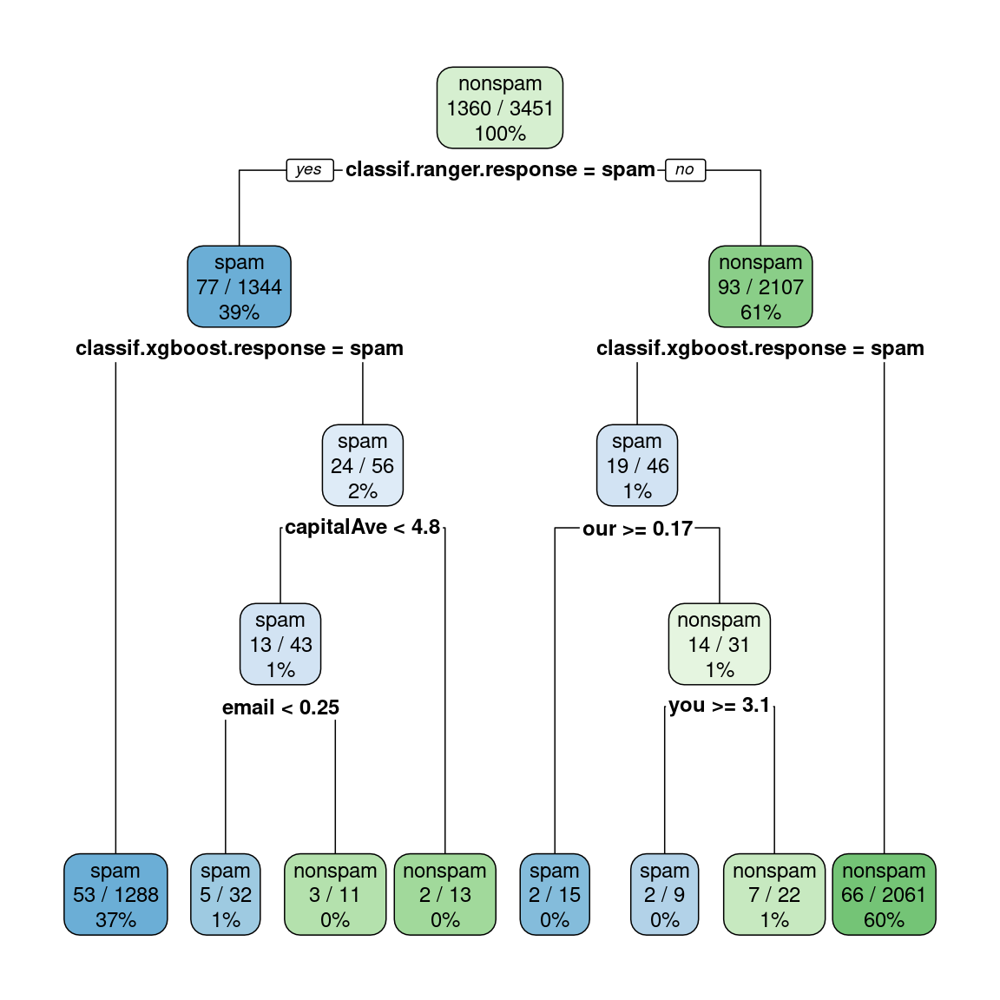

Misclassification error:

```r
stack_pred = stacked_lrn$predict(task, row_ids = test_indx)
stack_pred$score()
```

```
classif.ce 
0.04869565 
```

# Final Benchmark {-}


```r
res = lapply(models, function(model) {
  model$predict(task, test_indx)$score()
})

dplyr::bind_rows(res) %>% 
  add_column(model = names(res), .before = 1) %>% 
  mutate(classif.ce = num(100*classif.ce, digits = 2)) %>%
  arrange(classif.ce)
```

```
# A tibble: 10 × 2
   model         classif.ce
   <chr>          <num:.2!>
 1 xgb                 4.78
 2 stacked_lrn         4.87
 3 radial_svm          5.22
 4 nnet                5.48
 5 random_forest       5.57
 6 bagged_trees        6.70
 7 poly_svm            6.70
 8 lasso               7.30
 9 lasso2              7.39
10 tree                8.52
```


# R Session Info {-}


```{.r .fold-show}
xfun::session_info()
```

```
R version 4.2.1 (2022-06-23)
Platform: x86_64-pc-linux-gnu (64-bit)
Running under: Ubuntu 20.04.5 LTS

Locale:
  LC_CTYPE=en_US.UTF-8       LC_NUMERIC=C              
  LC_TIME=en_US.UTF-8        LC_COLLATE=en_US.UTF-8    
  LC_MONETARY=en_US.UTF-8    LC_MESSAGES=en_US.UTF-8   
  LC_PAPER=en_US.UTF-8       LC_NAME=C                 
  LC_ADDRESS=C               LC_TELEPHONE=C            
  LC_MEASUREMENT=en_US.UTF-8 LC_IDENTIFICATION=C       

Package version:
  askpass_1.1                  assertthat_0.2.1            
  backports_1.4.1              base64enc_0.1.3             
  bbotk_0.7.0                  bit_4.0.4                   
  bit64_4.0.5                  blob_1.2.3                  
  bookdown_0.30                broom_1.0.1                 
  bslib_0.4.0                  cachem_1.0.6                
  callr_3.7.3                  cellranger_1.1.0            
  checkmate_2.1.0              class_7.3-20                
  cli_3.4.1                    clipr_0.8.0                 
  clue_0.3-61                  cluster_2.1.3               
  clusterCrit_1.2.8            codetools_0.2-18            
  colorspace_2.0-3             compiler_4.2.1              
  cpp11_0.4.3                  crayon_1.5.2                
  crosstalk_1.2.0              curl_4.3.3                  
  data.table_1.14.4            DBI_1.1.3                   
  dbplyr_2.2.1                 digest_0.6.30               
  dplyr_1.0.10                 DT_0.26                     
  dtplyr_1.2.2                 e1071_1.7-12                
  ellipsis_0.3.2               evaluate_0.18               
  fansi_1.0.3                  farver_2.1.1                
  fastmap_1.1.0                forcats_0.5.2               
  foreach_1.5.2                fs_1.5.2                    
  future_1.29.0                future.apply_1.10.0         
  gargle_1.2.1                 generics_0.1.3              
  ggplot2_3.4.0                glmnet_4.1-4                
  globals_0.16.1               glue_1.6.2                  
  googledrive_2.0.0            googlesheets4_1.0.1         
  graphics_4.2.1               grDevices_4.2.1             
  grid_4.2.1                   gridExtra_2.3               
  gtable_0.3.1                 haven_2.5.1                 
  highr_0.9                    hms_1.1.2                   
  htmltools_0.5.3              htmlwidgets_1.5.4           
  httr_1.4.4                   ids_1.0.1                   
  igraph_1.3.5                 isoband_0.2.6               
  iterators_1.0.14             jquerylib_0.1.4             
  jsonlite_1.8.3               knitr_1.40                  
  labeling_0.4.2               later_1.3.0                 
  lattice_0.20-45              lazyeval_0.2.2              
  lgr_0.4.4                    lifecycle_1.0.3             
  listenv_0.8.0                lubridate_1.9.0             
  magrittr_2.0.3               MASS_7.3.57                 
  Matrix_1.5-1                 memoise_2.0.1               
  methods_4.2.1                mgcv_1.8.40                 
  mime_0.12                    mlbench_2.1.3               
  mlr3_0.14.1                  mlr3cluster_0.1.5           
  mlr3data_0.6.1               mlr3extralearners_0.5.49-000
  mlr3filters_0.6.0            mlr3fselect_0.7.2           
  mlr3hyperband_0.4.3          mlr3learners_0.5.5          
  mlr3measures_0.5.0           mlr3misc_0.11.0             
  mlr3pipelines_0.4.2          mlr3tuning_0.16.0           
  mlr3tuningspaces_0.3.1       mlr3verse_0.2.6             
  mlr3viz_0.5.10               modelr_0.1.9                
  munsell_0.5.0                nlme_3.1.157                
  nnet_7.3-17                  openssl_2.0.3               
  palmerpenguins_0.1.1         paradox_0.10.0              
  parallel_4.2.1               parallelly_1.32.1           
  pillar_1.8.1                 pkgconfig_2.0.3             
  precrec_0.13.0               prettyunits_1.1.1           
  processx_3.7.0               progress_1.2.2              
  promises_1.2.0.1             proxy_0.4-27                
  PRROC_1.3.1                  ps_1.7.1                    
  purrr_0.3.5                  R6_2.5.1                    
  ranger_0.14.1                rappdirs_0.3.3              
  RColorBrewer_1.1.3           Rcpp_1.0.9                  
  RcppEigen_0.3.3.9.2          readr_2.1.3                 
  readxl_1.4.1                 rematch_1.0.1               
  rematch2_2.1.2               reprex_2.0.2                
  rlang_1.0.6                  rmarkdown_2.17              
  rpart_4.1.19                 rstudioapi_0.14             
  rvest_1.0.3                  sass_0.4.2                  
  scales_1.2.1                 selectr_0.4.2               
  shape_1.4.6                  splines_4.2.1               
  stats_4.2.1                  stringi_1.7.8               
  stringr_1.4.1                survival_3.4-0              
  sys_3.4                      tibble_3.1.8                
  tidyr_1.2.1                  tidyselect_1.2.0            
  tidyverse_1.3.2              timechange_0.1.1            
  tinytex_0.42                 tools_4.2.1                 
  tzdb_0.3.0                   utf8_1.2.2                  
  utils_4.2.1                  uuid_1.1-0                  
  vctrs_0.5.1                  viridis_0.6.2               
  viridisLite_0.4.1            visNetwork_2.1.2            
  vroom_1.6.0                  withr_2.5.0                 
  xfun_0.33                    xgboost_1.6.0.1             
  xml2_1.3.3                   yaml_2.3.5                  
```
